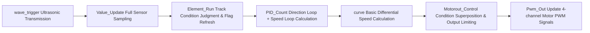

# Line-following Electromagnetic Tricycle
> This is my first intelligent vehicle project.

## Table of Contents
- [1. Project Overview](#1-project-overview)
- [2. Hardware Configuration & Pin Mapping](#2-hardware-configuration--pin-mapping)
- [3. Modular Structure of Engineering Files](#3-modular-structure-of-engineering-files)
- [4. Execution Timing of 10ms Core Interrupt](#4-execution-timing-of-10ms-core-interrupt)
- [5. Detailed Explanation of Core Functional Modules](#5-detailed-explanation-of-core-functional-modules)
- [6. Parameter Configuration & Function Switches](#6-parameter-configuration--function-switches)
- [7. Compilation, Flashing & Debugging Environment](#7-compilation-flashing--debugging-environment)
- [8. On-vehicle Debugging Precautions](#8-on-vehicle-debugging-precautions)
- [9. Open Source License Agreement](#9-open-source-license-agreement)

---

## 1. Project Overview
### Introduction
This complete source code is designed for competition-specific electromagnetic vehicle control, developed based on the `STC32G12K128` microcontroller. It supports all track operating conditions, including straight lines, large/small curves, continuous polyline turns, roundabouts, line-loss self-rescue, ultrasonic obstacle avoidance, and automatic parking by mileage.

- **Time-shared Isolated Control**: All real-time closed-loop operations run in a 10ms timer interrupt. Screen display, key scanning and serial communication are only processed in the main loop, which avoids interference with vehicle control timing and eliminates jitter and stalling.
- **Two Parameter Tuning Schemes**: On-site parameter adjustment without a computer via a 1.14-inch IPS screen; waveform visualization debugging via VOFA wireless serial port.
- **Adaptive PID**: Control gains automatically switch for startup, roundabout entry, roundabout cruising, roundabout exit and line-loss conditions, balancing smooth straight-line travel and fast curve response.
- **High-cohesion Modularization**: Sensor acquisition, PID algorithm, track logic and human-machine interaction are fully decoupled. Modifications to a single function will not affect the whole vehicle system.

### Vehicle Hardware Composition
Five electromagnetic inductors, IMU660 gyroscope, left/right orthogonal encoders, HC-SR04 ultrasonic module, 4-channel 17kHz PWM motor driver, IPS color screen, independent keys + DIP switches, buzzer, and battery voltage detection circuit.

---

## 2. Hardware Configuration & Pin Mapping
### 2.1 Basic Main Controller Parameters
| Item                       | Parameter             |
| -------------------------- | --------------------- |
| Main Control Chip          | STC32G12K128          |
| Closed-loop Control Period | 10ms (TIM4 Interrupt) |
| PWM Output Frequency       | 17000Hz               |
| Compilation Software       | MDK FOR C251          |

### 2.2 Peripheral Pin Definition (Macro-defined uniformly in `basefile.h`; only macros need modification for wiring changes)
#### 1) Electromagnetic ADC Acquisition
| Macro Channel | Hardware Pin | Function                  |
| ------------- | ------------ | ------------------------- |
| ADC1          | P17          | Left Horizontal Inductor  |
| ADC7          | P14          | Right Horizontal Inductor |
| ADC2          | P05          | Left Vertical Inductor    |
| ADC6          | P16          | Right Vertical Inductor   |
| ADC4          | P06          | Middle Auxiliary Inductor |
| protect       | P15          | Battery Voltage Detection |

#### 2) Motor Drive PWM
| Definition | Pin  | Action               |
| ---------- | ---- | -------------------- |
| PWM_L1     | P62  | Left Wheel Forward   |
| PWM_L0     | P60  | Left Wheel Backward  |
| PWM_R1     | P66  | Right Wheel Forward  |
| PWM_R0     | P64  | Right Wheel Backward |

#### 3) Encoder Speed Measurement
| Definition | Pin       | Function                        |
| ---------- | --------- | ------------------------------- |
| Encoder_L  | CTIM0_P34 | Left Wheel Pulse Counting       |
| Dir_L      | P35       | Left Wheel Direction Judgement  |
| Encoder_R  | CTIM3_P04 | Right Wheel Pulse Counting      |
| Dir_R      | P53       | Right Wheel Direction Judgement |

#### 4) Ultrasonic & Human-Machine Peripherals
- Ultrasonic Module: Transmit pin `P10`, echo interrupt pin `P11`
- Keys: `P36/P71/P70/P72/P73`
- DIP Switches: `P75(Boma1)`, `P76(Boma2)`
- Buzzer: `P77`
- Debug Serial Port: `UART4` (connected to wireless module for VOFA)

---

## 3. Modular Structure of Engineering Files
### Project Directory Tree
```
├── main.c          Program entry, global initialization, all interrupt entry points
├── isr.c           Interrupt service functions for serial port, timer and external interrupts
├── basefile.c/h    Low-level hardware initialization, global variables, general utility macros
├── direction.c/h   Inductor sampling, gyroscope reading, directional PD, angle controller
├── speed.c/h       Encoder speed measurement, left/right wheel incremental PI, PWM output
├── wave.c/h        Low-level ultrasonic driver, distance conversion calculation
├── element.c/h     Overall track logic, differential speed fusion, motor output distribution
├── display.c/h     IPS screen driver, key-based parameter tuning, VOFA waveform upload
```

### Core Responsibilities of Each File
1. **`main.c`**
Performs global initialization on power-up and enables the 10ms TIM4 core interrupt. The infinite `while(1)` main loop only handles screen refresh, key scanning and serial communication without any control logic. It contains ultrasonic timing interrupt, echo external interrupt and four-channel serial interrupt entry functions.

2. **`basefile.c/h`**
Encapsulates initialization of ADC, encoder, PWM, screen and gyroscope peripherals.
- `Parameter_Init()` loads all preset parameters on power-up
- `Value_Update()` unified sensor reading interface, acquires all sensor data once per interrupt cycle
Built-in general utility macros:
```c
func_limit_ab(x,a,b)  // Bilateral value limiting
MYADS(x)              // Absolute value calculation
GTSD(x)               // Tens digit rounding normalization
```
Global flags, counters and control variables are declared as external variables here.

3. **`direction.c/h` (Core Line-following Module)**
- `ADC_Getvalue()`: 5-point sampling, bubble sort extreme value filtering, moving average filtering; supports automatic/manual inductor calibration and signal normalization; applies weighted difference-sum algorithm for different track conditions and outputs tracking deviation `inductance`.
- `IMU660RA_Kdread()`: Gyroscope sliding window filtering and integral calculation to obtain cumulative vehicle yaw angle.
- `Direction_Control()`: Adaptive PD controller with two vehicle control modes; superimposes gyro differential term to suppress tail flicking; segmented integral limiting to prevent integral windup.
- `Foldline_Control()`: Independent angle PD controller dedicated to obstacle avoidance steering.

4. **`speed.c/h`**
- `Speed_Measure()` reads encoder pulses and converts data to real-time vehicle speed and cumulative travel distance `S`.
- `Speed_Control()` independent incremental PI controllers for left and right wheels; parameters auto-switch under different track conditions.
- `Pwm_Out()` unified encapsulated interface for positive/negative duty cycle output.

5. **`element.c/h` (Master Track Logic Controller)**
Integrates full judgment logic for vehicle startup, roundabouts, polyline turns, line loss, obstacle avoidance and automatic parking.
- `curve()` calculates basic differential speed
- `Motorout_Control()` superimposes correction values based on track conditions and applies global output limiting
All adjustable macro parameters are stored in `element.h`.

6. **`wave.c/h`** Configures ultrasonic IO ports and interrupts, triggers periodic ultrasonic transmission, calculates measured distance via echo timing.

7. **`display.c/h`**
Contains six categories of display pages; supports page flipping, parameter increment/decrement and one-click full vehicle reset via physical keys. Converts floating-point numbers to 4-byte data and uploads 6-channel real-time waveforms to VOFA host computer.

8. **`isr.c`** Only contains interrupt callback logic; no business algorithms, solely responsible for data caching and flag bit assertion.

---

## 4. Execution Timing of 10ms Core Interrupt
> Execution sequence is fixed and non-adjustable. Delays, screen refreshing and massive serial transmission are strictly forbidden inside the interrupt service routine.


Only three non-real-time tasks run in the main loop:
1. VOFA serial waveform data transmission
2. Physical key scanning
3. IPS screen refresh rendering

---

## 5. Detailed Explanation of Core Functional Modules
### 5.1 Electromagnetic Inductor Signal Processing
1. **Noise Reduction Filtering**: Collect 5 consecutive samples per channel, discard maximum and minimum values after sorting, then average the remaining three readings.
2. **Two Calibration Schemes + Normalization to Find Peak Values**
    - Automatic Calibration: Set `zuizhi_button=1` to automatically sample inductor peak values and store them in an array on power-up.
    - Manual Calibration: Directly modify macros such as `ADC_SLm` defined in `element.h`.
3. **Signal Normalization**: Enable `guiyihua_button` to unify the range of inductor readings and eliminate hardware individual differences.
4. **Dynamic Weighted Difference-Sum Algorithm**: Higher weights assigned to horizontal inductors for straight-line tracking; increased vertical inductor weights for roundabouts and sharp curves to boost steering responsiveness.

### 5.2 Adaptive Direction-loop PD Controller
| car_mode                 | Control Logic                                                | Applicable Scenario                          |
| ------------------------ | ------------------------------------------------------------ | -------------------------------------------- |
| 0                        | Dynamic KP generated via error cubic function for gentle gain variation under small tracking errors | Low-speed smooth tracks                      |
| 1                        | Fixed segmented KP/KD for different error ranges to enable fast response under large deviations | High-speed tracks with frequent sharp curves |
| Additional Optimizations | —                                                            | —                                            |

- Gyroscope differential term introduced to counteract inertial tail flick during cornering
- Integral accumulation only activated when tracking error exceeds threshold; integral cleared directly under minor deviation to eliminate windup
- PID gains and maximum motor output limits automatically overwritten during line loss, roundabout entry and roundabout exit

### 5.3 Closed-loop Speed Control
Two independent incremental PI controllers for left and right wheels to solve vehicle drift caused by inconsistent motor speeds:
- Amplified proportional gain during startup to rapidly reach target speed
- Maximum output automatically reduced when navigating roundabouts or avoiding obstacles to prevent track departure
- Cumulative mileage recorded via encoders; vehicle automatically stops and resets upon reaching preset travel distance

### 5.4 Complete Roundabout Recognition Logic
1. Pre-entry Detection: Full saturation readings from both horizontal inductors trigger roundabout entry judgment
2. Turning Direction Classification: Difference between vertical inductor readings determines left/right roundabout
3. Roundabout Cruising: Switch to low-gain PID once cumulative gyro yaw angle reaches threshold
4. Roundabout Exit: Exit confirmed when cumulative rotation angle approaches ±360° plus full saturation horizontal inductor signals
5. Post-exit Reset: Automatically reset yaw angle, counters and all track condition flags

### 5.5 Polyline Corner Navigation
Polyline inflection point detected when absolute electromagnetic tracking error > 80; two-stage differential deceleration applied:
1. Stage 1: Heavy deceleration on single wheel to minimize turning radius
2. Stage 2: Balanced synchronized wheel output for smooth straightening; standard straight-line differential speed restored after counting threshold met

### 5.6 Line-loss Protection Mechanism
Complete line loss is triggered when readings from all five inductors drop below threshold:
- Short-term line loss: Slight reverse rotation of single wheel to search for track lines
- Long-term line loss: Motor outputs cleared; `rest()` function called to fully reset the vehicle and prevent off-track runaways

### 5.7 Ultrasonic Obstacle Avoidance Workflow
1. Obstacle avoidance activated when measured distance falls below threshold; electromagnetic direction loop temporarily disabled
2. Gyro angle PD controller enabled to execute two fixed-angle steering maneuvers for obstacle bypass
3. Travel preset distance then reverse steering to straighten trajectory, automatically restore electromagnetic line-following control

### 5.8 Dual Debugging System
- **Local Parameter Tuning (IPS Screen + Physical Keys)**
Six functional pages: Raw ADC readings, track condition flags, vehicle speed & battery voltage, PID parameter panel, function switch panel, startup configuration. All parameters adjustable on-site without a computer.
- **Host Computer Debugging (VOFA+)**
Customizable 6-channel floating-point real-time waveform upload; intuitive visualization of tracking deviation, vehicle speed and gyroscope data for rapid PID parameter tuning.

---

## 6. Parameter Configuration & Function Switches
### 6.1 Adjustable Parameter Categories (All Defined in `element.h`)
1. PID Parameters: Direction loop P/I/D gains, gyro differential coefficient `dirangle_D`, left/right speed loop P/I gains
2. Electromagnetic Tracking Parameters: Weighting coefficients `Pa/Pb/Pc/Pp` for difference-sum algorithm, calibrated maximum inductor readings, normalization coefficients
3. Limiting Parameters: PID error limit, integral saturation limit, maximum motor output duty cycle
4. Threshold Parameters: Roundabout detection distance, polyline trigger error, ultrasonic obstacle distance threshold, parking mileage, obstacle avoidance turning angle

### 6.2 Global Function Switches (Toggle via Mode Page on Screen)
| Switch Variable | Function Description                                         |
| --------------- | ------------------------------------------------------------ |
| guiyihua_button | Enable/disable inductor signal normalization                 |
| zuizhi_button   | Enable automatic peak-value calibration of inductors on power-up |
| fold_button     | Enable/disable polyline corner navigation function           |
| bizhang_button  | Enable/disable automatic ultrasonic obstacle avoidance       |
| car_mode        | Switch between two adaptive PID algorithms for direction loop |
| chuankou_button | Toggle VOFA serial waveform data upload                      |

---

## 7. Compilation, Flashing & Debugging Environment
| Tool                       | Version & Description                                |
| -------------------------- | ---------------------------------------------------- |
| Compilation IDE            | MDK FOR C251 V5.60                                   |
| Target Microcontroller     | STC32G12K128                                         |
| Flash Programming Software | STC-ISP (IRC clock must match the comment in main.c) |
| Waveform Debugging Tool    | VOFA+ (paired with wireless serial module)           |

> Note: Mismatched system clock settings between flash software and code comments will cause timing disorder for serial ports, PWM outputs and all timers.

---

## 8. On-vehicle Debugging Precautions
1. Delays, screen refresh and mass serial transmission are prohibited inside the 10ms interrupt service routine. These operations break the closed-loop control cycle and cause severe vehicle vibration.
2. Automatic inductor calibration must be executed after replacing inductors or changing tracks. Uncalibrated signals lead to biased difference-sum calculation and vehicle drift.
3. PID tuning workflow: Rough adjustment via IPS screen → fine tuning with VOFA waveform observation. Increase KD to suppress straight-line jitter; reduce KP if vehicle rushes out of curves.
4. Ultrasonic sensors are susceptible to strong ambient light and ground reflections. Increase `wave_limit` distance threshold to eliminate false obstacle triggers.
5. Low-battery detection function is embedded in code; uncomment the corresponding segment to enable automatic low-voltage shutdown, recommended for long-duration vehicle testing.
6. Always call the unified `rest()` function for full vehicle reset. Do not manually clear individual flags or counters separately, which leaves residual logic states and causes erratic vehicle movement.

---

## 9. Open Source License Agreement
1. This project is secondary developed based on the underlying driver library for STC32G provided by Zhufei Technology. The code is **only permitted for learning and communication in university intelligent vehicle competitions; commercial profit-making use is prohibited**.
2. Original copyright comments embedded in source code shall not be deleted during secondary modification, redistribution or sharing of this project.
3. The code reserves extension frameworks for ramp tracks, cross tracks and remote control functions. Users may independently add judgment logic for additional track conditions.

### Translation Standard Notes
1. Terminology strictly follows international intelligent vehicle & embedded industry standards (e.g. incremental PI, integral windup, duty cycle, closed-loop control, interrupt service routine)
2. All variable/function macro names retain original C code identifiers without translation for engineering consistency
3. Competition-specific track terms (roundabout, polyline fold, line-following electromagnetic vehicle) adopt commonly accepted wording in global university autonomous vehicle contests
4. Technical sentence structure conforms to English embedded open-source README writing conventions; ambiguous Chinese descriptive expressions rephrased for native engineering readability
5. Hardware brand, chip model, software names keep official original English naming
